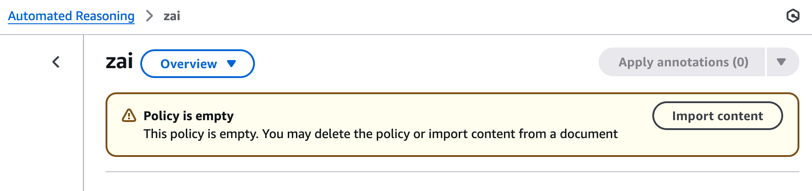
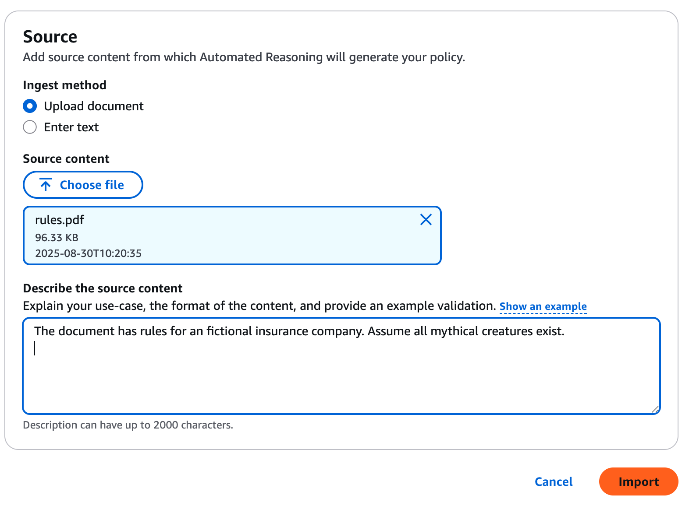
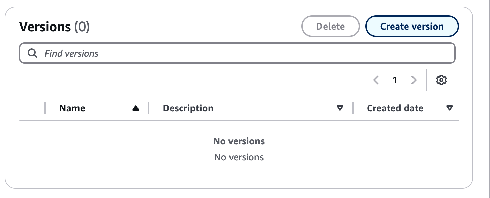

# Playground for Amazon Bedrock Automated Reasoning guardrails

With Bedrock automated [reasoning](https://docs.aws.amazon.com/bedrock/latest/userguide/guardrails-automated-reasoning-checks.html) you can check LLM output against logical rules.

With the app you can evaluate the results.

Automated Reasoning imports a file, which describes the rules and translates it to [rules](https://aws.amazon.com/blogs/aws/minimize-ai-hallucinations-and-deliver-up-to-99-verification-accuracy-with-automated-reasoning-checks-now-available/), _variables_ and _types_.
The theory is explained [here](https://smt-lib.org/) and also [here](https://en.wikipedia.org/wiki/Satisfiability_modulo_theories).

With this app you can define short questions and answers in `config.yml` and test then with `task run-short`

Or check longer questions/answers defined in the `chat` subdirectory.
And run them with `task run-long`

Some example results are captured in `results/run_bad` and `results/run_good`

Please note that additional charges will apply.
I will take no responsibility whatsoever for charges or AWS functions.

This was tested on September 1st, 2025.
AWS services could be subject to change.

## Installation

## Install GO

See [instruction](https://go.dev/).

### Create Automated Reasoning

See [AWS documentation](https://docs.aws.amazon.com/bedrock/latest/userguide/create-automated-reasoning-policy.html)

```bash
task create
```


### Import the rules

1\. Find policy, choose import content


2\. Upload `doc/rules.pdf` with description.

```txt
The document has rules for an fictional insurance company. Assume all mythical creatures exist.
```


3\. Wait

### Create Guardrail

Create a guardrail and skip to Automated reasoning with the AWS console.

Step | Parameter | Value
:----|:----------|:-----
1- Provide guardrail details | Name | ZAI-Reasoning
1 | Cross-Region inference - optional | enable
7 - Add Automated Reasoning check - optional | enable | true
7 | Policy name | zai
7 | Version | DRAFT

### Create a Guardrail version



### Update local file `config.yml`

Copy `config_example.yml` `config.yml` and replace with your own values:

```yml
guradrail:
  id: uhzortfljva5
  version: 1
```

## Run

```bash
task run-short
```

Sample output:

```txt
task: [build] mkdir -p dist
task: [build] go build -o dist/checker main/main.go
task: [run-short] dist/checker --short
Question 0: The client plans to held 51 zombies. Is this covered by basic insurance?
Answer 0: This is not covered by basic insurance
1: TRANSLATION_AMBIGUOUS
Question 1: The client plans to held 51 zombies with basic insurance policy. Is this covered by basic insurance?
Answer 1: Yes this is covered with basic insurance.
2: IMPOSSIBLE
Question 2: I have some vampires and some zombies colocated. Is this allowed?
Answer 2: No it is not allowed.
3: VALID
3: NO TRANSLATION
Question 3: I have some vampires and some zombies colocated. Is this covered with a basic policy?
Answer 3: Yes, it is covered with a basic policy.
4: VALID
Question 4: I have some vampires and some zombies colocated.The customer has a basic policy. Is this covered with a basic policy?
Answer 4: Yes, it is covered with a basic policy.
...
```
